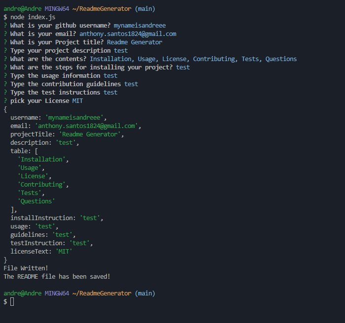

# Project Title: test


## Description
test

## Table of Contents
* [Installation](#installation) 
 
* [Usage](#usage) 
 
* [License](#license) 
 
* [Contributing](#contributing) 
 
* [Tests](#tests) 
 
* [Questions](#questions) 
 


## Installation Instructions
```bash
test
```

## Usage
```javascript
test
```

## Contribution Guidelines 
[test](https://github.com/test) 


## Test Instructions 
test

## License
MIT

## Questions
​

​
If you have any questions about the repo, open an issue or contact [mynameisandreee](https://github.com/mynameisandreee) directly at anthony.santos1824@gmail.com.

## Screenshot


